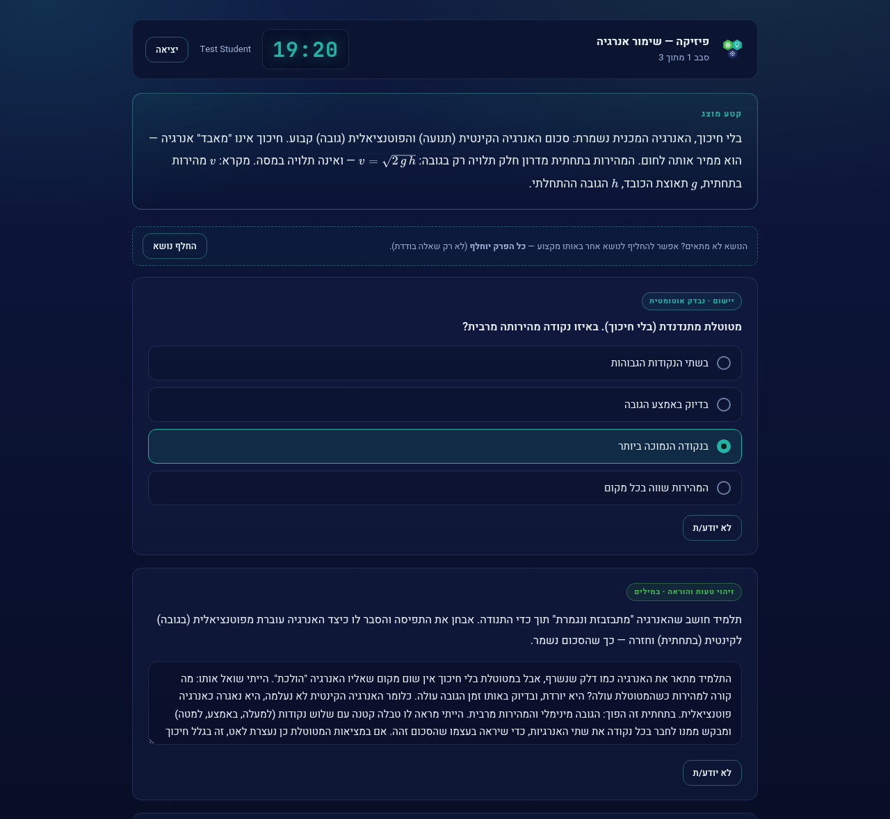
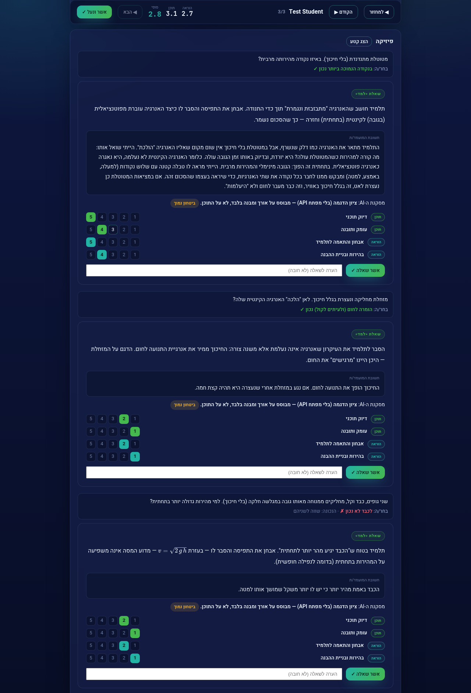
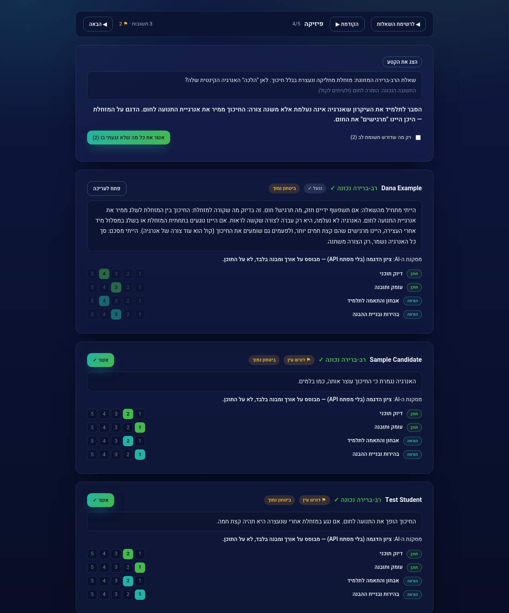
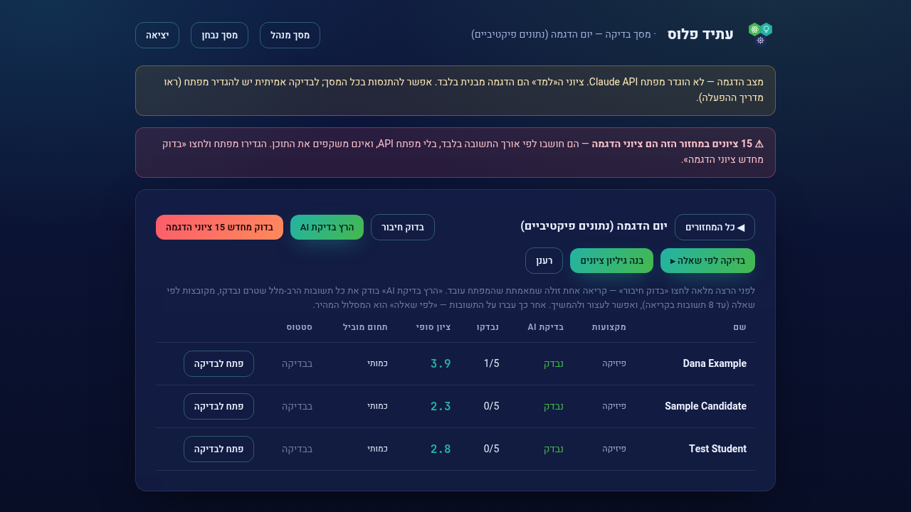
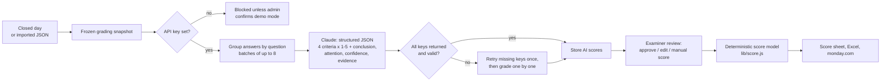
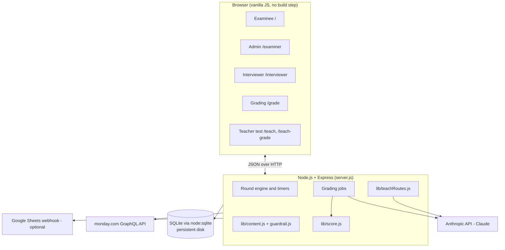

# AI-Graded Assessment Platform

A Hebrew (RTL) web platform for running live, multi-round assessment days and grading written answers afterwards, with Claude as a rubric-based grader and a human examiner making the final call.

> The UI, question bank and prompts are in Hebrew. The code, and this README, are written for English-speaking readers.

## Screenshots

All screenshots come from a local run with made-up examinees ("Dana Example", "Test Student", "Sample Candidate") and **no API key**, so every AI score shown is a **demo-mode placeholder** computed from answer length only. None of it is real Claude output. The app flags this itself with the red banners and the "ציון הדגמה" (demo score) note on each answer.

**Examinee view: a physics chapter with a multiple-choice item and a written "teach it" answer, with the chapter timer at the top.**


**Per-answer grading for one examinee: a correct, a partial and a wrong answer, each with 4 rubric scores and the AI conclusion line (demo-mode placeholder scores, not real Claude grading; because demo scores depend only on length, the short partial and wrong answers get the same low scores).**


**Examiner review by question: all answers to one question side by side, with "needs attention" flags, per-item approve and bulk approve. The first answer is already approved and locked (demo-mode scores).**


**Grading overview for a closed day: examinees, grading progress and final scores, under the banners warning that all 15 scores are demo placeholders.**


---

## Why

At the Atid+ NGO, candidates for teaching scholarships go through an **assessment day**. They rotate through timed subject chapters and a personal interview across several rounds. The main thing the test measures is whether a candidate can *explain* material to a student, not only solve it. Answers like that are open-ended, so scoring them by hand is slow and inconsistent.

I built this platform to run the day itself (registration, rounds, timers, interviews) and to handle the grading afterwards. An LLM proposes rubric scores for every written answer, and a human examiner reviews, corrects and approves them before any score reaches the NGO's monday.com board. The NGO uses it for its assessment days. A separate module runs a 25-minute written test for teacher applicants.

## Features

**Running the day**
- Four role-based screens: examinee (`/`), admin/examiner (`/examiner`), interviewer (`/interviewer`) and grading (`/grade`). Admins and interviewers log in with passwords.
- A live round engine with 3–5 rounds per day. In each round, the admin marks who goes to an interview and everyone else automatically gets their next unfinished chapter.
- Server-authoritative timers: a per-examinee chapter timer (20 min by default, `SLOT_DURATION_SEC`) and a shared round clock that the admin, interviewer and examinee screens all read.
- Resilience: answers are queued in `localStorage` and flushed to the server. An examinee who disconnects can log back in with the same name and code, on any device, and resume where they stopped. The server takes an automatic JSON backup every 5 minutes.
- Multiple assessment days are stored separately. Closing a day takes a frozen **grading snapshot**, and that snapshot survives if the live day is later deleted.
- Interviewer briefs are bulk-pasted and matched to examinees with a Hebrew-aware name matcher (see below).
- Exports: an Excel workbook of all answers, a JSON export that can be re-imported for grading, and an optional live mirror to Google Sheets through an Apps Script webhook ([setup](docs/google-sheets-setup.md)).

**Content bank**
- Questions are stored as data, not code. There are 42 active chapters across 10 subjects in [`content/`](content/). Each chapter pairs multiple-choice "apply" items with written "teach this to a student" items. Formulas are written in KaTeX.
- A content guardrail ([`lib/guardrail.js`](lib/guardrail.js)) validates every chapter when it loads, and any chapter that fails is never offered to examinees (see [Content guardrail](#content-guardrail)).

**Grading and reporting**
- Claude grades written answers against a 4-criterion rubric. A human reviews each proposed score, and the final score is computed by a deterministic, unit-tested model.
- Grading can be done question by question: all answers to one question appear together, sorted by AI score, with a "needs attention" filter and bulk approval.
- A score sheet with per-day rank and percentile, a merged export across several days, and a push to monday.com.

**Teacher-applicant test** (separate module, [`lib/teachRoutes.js`](lib/teachRoutes.js))
- A timed 6-question test for teacher applicants in 4 subjects, built on real Israeli matriculation (Bagrut) questions. It has its own tables, screens and proctoring tools (pause, extra time, force-submit, reopen a question, event log).
- Mechanical parts are auto-scored. Written parts are scored with rubric checkboxes, which the AI pre-fills and the examiner can override.
- Results are sent to an existing monday.com board by finding the candidate's row by name.

## How AI grading works

Grading runs **after** the assessment day. It never runs while candidates are being tested. The code is in [`lib/aiGrade.js`](lib/aiGrade.js), orchestrated by `runGradingJob` in [`server.js`](server.js).



### 1. Rubric with anchored scale
Each written "teach" answer gets an integer from 1 to 5 on four criteria. The system prompt spells out what 1, 3 and 5 mean for each one:

| Criterion | Axis | What it measures |
|---|---|---|
| `accuracy` | content | Is the content correct? For error-diagnosis items, did the candidate find the root misconception? |
| `depth` | content | Real understanding vs. memorisation |
| `diagnosis_fit` | teaching | Does the answer address *this* student's specific difficulty, at the right level? |
| `clarity` | teaching | Is the explanation structured, and does it build understanding (e.g. with an example or analogy)? |

The prompt also includes explicit rules: an empty or "I don't know" answer gets 1 on every criterion; nice wording must not be rewarded over correctness; and when several answers are shown together, each is scored **against the anchors, not against the others** ("if all answers are excellent, all get 5").

### 2. Batching by question
Answers are grouped by `(chapter, question)` into batches of up to 8 (`BATCH_SIZE`), and a batch never mixes questions. The question and source text are sent once per batch, which reduces the number of API calls. It also lets the model apply the scale consistently across answers to the same question, the way a human grader works through one question at a time. Three batches run concurrently. [`scripts/tests/aigrade_test.js`](scripts/tests/aigrade_test.js) checks that no answer is lost or duplicated in grouping and that a score can't be attached to the wrong candidate.

### 3. Anonymisation
Inside a batch, answers are keyed with opaque IDs (`a1`…`a8`). No names or examinee codes go to the model, so identity cannot influence the score.

### 4. Structured output, validated
- The response is constrained with a **JSON Schema** (`output_config.format: json_schema`). Scores are `enum [1..5]`, `confidence` is `high|medium|low`, and no extra properties are allowed. The code does not rely on "reply with JSON only" in the prompt.
- Every entry is then normalised: scores are rounded and clamped to 1–5, text fields are truncated, and an entry counts as valid only if all four criteria are present.
- The code treats `stop_reason: refusal` and `max_tokens` truncation as explicit errors, so it never tries to parse a partial response.
- The system prompt is sent with `cache_control: ephemeral` so prompt caching can reuse it across batches.

### 5. Retries and fallbacks
- **Transport:** the official `@anthropic-ai/sdk` client uses `maxRetries: 5` with backoff on 429 and 5xx errors, and a 10-minute timeout.
- **Batch level:** if a batch returns only some of its keys, the valid results are kept and the call is retried **only for the missing keys** (at most 2 attempts).
- **Item level:** anything still missing is graded one answer per call. An item that still fails is marked `failed` with the error message and flagged "check manually".
- The grading job can be resumed: it only processes items that are not already `done`. The admin can also re-run only the failed items.
- A cheap **test-key** call checks the key before a full run and maps 401, 403, 404, 429 and 5xx responses to human-readable explanations.

### 6. Demo mode (no API key), with a safety lock
If no `ANTHROPIC_API_KEY` is set, the grader falls back to a **demo mode** that scores by answer length only, so the workflow can be shown end-to-end at no cost. Because a length heuristic must never be mistaken for real grades:
- `run-ai` returns **400 `demo_block`** unless the admin explicitly sends `confirm_demo: true`.
- Every demo-scored item is flagged `ai_demo = 1`, and the grading screen shows a red banner with how many there are.
- `only_demo: true` resets exactly those items to `pending` and re-grades them once a key is added. Without this flag, demo scores would have been stuck as `done` and never replaced.

### 7. Human examiner in the loop
The AI only *proposes* scores. The examiner decides:
- Each item shows the AI's scores, a one-line conclusion, an **"attention" note** (what the human should check) and a **confidence** level. The attention field feeds a "needs attention" filter, and it is left empty on purpose when there is nothing real to flag.
- The examiner can edit any criterion. **Human scores always override AI scores** (`effectiveItemScores`), and every change is written to a `grading_audit` table with the old value, the new value and a timestamp.
- Items are approved one by one or in bulk. Bulk approval touches only untouched items by default. An item the AI failed on **cannot be approved without a manual score**.
- The examiner can manually override an examinee's final scores.
- An examinee's score is shown as **pending**, not as a number, until every written answer has an AI or human score. Otherwise a sheet with only multiple-choice scores would show inflated results.

### 8. Deterministic scoring on top of the LLM
The LLM produces per-criterion scores only. Final scores come from a pure, unit-tested function ([`lib/score.js`](lib/score.js)):
- **Teaching score** = 0.75 × teaching axis (`diagnosis_fit`, `clarity` across all written answers) + 0.25 × the mandatory general chapter (the only chapter everyone takes).
- **Accuracy gate:** if `accuracy` is 2 or lower, that item's contribution to the teaching score is halved, so "beautiful but wrong" answers don't score well.
- **Subject bonus:** the strongest subject adds up to a capped bonus (caps depend on how scarce the subject is, e.g. higher for 5-unit math and physics). A bonus **can never lower** a score, which [`score_model_test.js`](scripts/tests/score_model_test.js) asserts.

### Teacher-applicant grader
[`lib/teachAi.js`](lib/teachAi.js) uses a different design: a **binary per-criterion** judgement (`met: true/false`), each backed by an evidence quote of up to 12 words from the answer. The instruction is to be conservative: a criterion counts as met only if it is stated or directly implied. The output uses a per-question JSON schema, the same demo fallback applies, and manual examiner scores always take precedence over AI suggestions.

### Model configuration
The model and reasoning effort are set through `GRADING_MODEL` (default in code: `claude-opus-5`) and `GRADING_EFFORT` (default `medium`). The project uses its own env var names on purpose: `CLAUDE_MODEL` and `CLAUDE_EFFORT` were being silently overridden by other developer tools.

## Content guardrail

This is separate from the LLM. [`lib/guardrail.js`](lib/guardrail.js) validates the question bank when the server starts and when you run `npm run check-content`:
- Teaching questions must be answerable in words. Prompts that ask the candidate to "draw", "write an equation", "build a table" and so on are rejected, and teaching items must be marked `answer_mode: "text_explanation"`.
- Every KaTeX expression must render. This catches formulas broken by a lost backslash.
- Multiple-choice items must have exactly one correct option.
- A warning is raised when a decoding passage is too short to define its terms.

Chapters with errors are loaded for reference only and are never offered to examinees.

## monday.com integration

[`lib/monday.js`](lib/monday.js) is a small GraphQL client for the monday.com API (`MONDAY_API_TOKEN`).
- **It writes only the mapped columns.** It uses `change_multiple_column_values` rather than an Excel "overwrite" import, which could blank columns missing from the file. Empty values are never sent, so an existing cell is never erased.
- **Preview before push:** the admin chooses a board, maps fields (score, teaching, quantitative, English, recommendation) to columns, sees which rows matched, and then pushes. If the token fails, the push stops instead of flooding errors.
- The client handles GraphQL errors that come back with HTTP 200, and it paginates board items with cursors.
- A no-token fallback returns TSV output in the board's own row order, for a single paste. Unmatched rows are returned blank so the rows below don't shift.
- **Name matching** ([`lib/nameMatch.js`](lib/nameMatch.js)) is built for Hebrew names: it normalises punctuation and final letters (ם→מ, etc.) and handles middle names, reversed order (family name first), partial names and edit distance of 2 or less. Only an **exact** match is applied automatically. Fuzzy matches are shown as suggestions with a reason and a confidence level, and a human picks.
- The token is never stored in the database, returned in responses or logged.

## Architecture



- [`server.js`](server.js): all HTTP routes for the assessment day and grading.
- [`db.js`](db.js): schema and in-place migrations on the built-in `node:sqlite` (live tables, frozen `grading_*` snapshot tables, `grading_audit`, `teach_*` tables).
- [`lib/`](lib/): grading (`aiGrade.js`, `teachAi.js`), scoring (`score.js`), content loading and validation (`content.js`, `guardrail.js`), `monday.js`, `nameMatch.js`, scheduling helpers, and the teacher-test module.
  - `lib/grade.js` is an older standalone CLI grader (`npm run grade`) that writes JSON reports. It predates the batched, schema-constrained grader and is kept as a legacy path.
- [`public/`](public/): static HTML, CSS and vanilla JS for each screen. KaTeX is used for math rendering.
- [`content/`](content/): the question bank as JSON (`archive/` keeps retired chapters so older days can still be graded).

## Tech stack

- **Runtime:** Node.js 24+ (uses the built-in `node:sqlite`)
- **Server:** Express 4
- **Database:** SQLite (`node:sqlite`, no external DB)
- **LLM:** Anthropic Claude via `@anthropic-ai/sdk` (structured outputs, prompt caching)
- **Frontend:** vanilla JS, HTML and CSS, RTL, KaTeX. No framework, no build step
- **Files:** `xlsx` for Excel exports
- **Integrations:** monday.com GraphQL API, Google Apps Script webhook (optional)
- **Hosting:** Render (web service + persistent disk)

## Run locally

Requires **Node.js 24 or newer**.

```bash
git clone https://github.com/omerbbbb/ai-graded-assessment-platform.git
cd ai-graded-assessment-platform
npm install

# Set both passwords before running.export INTERVIEWER_PASSWORD='choose-another-password'

npm start            # http://localhost:3000
```

Then open `http://localhost:3000` (examinee), `/examiner` (admin), `/interviewer` and `/grade`.

> **Important:** both passwords are required. If `EXAMINER_PASSWORD` or `INTERVIEWER_PASSWORD` is not set, that login is disabled.
### Environment variables

| Variable | Required | Purpose |
|---|---|---|
| `EXAMINER_PASSWORD` | **Yes** | Admin and grading screens  |
| `INTERVIEWER_PASSWORD` | Yes, if interviewers are used | Interviewer screen|
| `ANTHROPIC_API_KEY` | For real grading | Without it, grading runs in demo mode only |
| `GRADING_MODEL` | No | Default `claude-opus-5` |
| `GRADING_EFFORT` | No | `low` / `medium` / `high` / `xhigh` / `max`, default `medium` |
| `MONDAY_API_TOKEN` | No | Enables direct pushes to monday.com |
| `SHEETS_WEBHOOK_URL` | No | Live mirror of submitted answers to Google Sheets |
| `DB_PATH` | No | SQLite file, default `data/assessment.db` |
| `PORT` | No | Default `3000` |
| `SLOT_DURATION_SEC` | No | Chapter length, default `1200` (20 min) |
| `BACKUP_INTERVAL_MIN` | No | Auto-backup interval, default `5` |

For local use, the API key, model and webhook can also go in `config.local.json` (copy [`config.example.json`](config.example.json)). Never commit that file.

Check the question bank:

```bash
npm run check-content
```

## Deploy

The app is set up for **Render** with [`render.yaml`](render.yaml):
- A web service on an always-on plan (`starter`). The free tier spins down when idle, which would disrupt a live assessment day (in-memory sessions are lost on restart).
- Build `npm install`, start `npm start`, health check at `/healthz`.
- A **1 GB persistent disk** mounted at `/var/data`, with `DB_PATH=/var/data/assessment.db`, so answers survive restarts.
- Secrets (`EXAMINER_PASSWORD`, `INTERVIEWER_PASSWORD`, `ANTHROPIC_API_KEY`, `MONDAY_API_TOKEN`) are declared with `sync: false` and set in the Render dashboard, never in the repo.

The Blueprint file `render.yaml` sits at the repository root.

For a single venue without internet, the same server can run on one laptop, with the other machines connecting over the local Wi-Fi network (`http://<server-ip>:3000`).

## Tests

The tests are plain Node scripts in [`scripts/tests/`](scripts/tests/). No test framework is used. **None of them make paid API calls.**

Offline (no server needed):

```bash
node scripts/tests/score_model_test.js   # scoring model: weights, accuracy gate, bonus never lowers a score
node scripts/tests/aigrade_test.js       # batching: nothing lost or duplicated, scores stay with the right candidate
node scripts/tests/strict_scan.js        # frontend scan for undeclared variables under 'use strict'
npm run check-content                    # question-bank guardrail
```

Against a server running on a throwaway database:

```bash
DB_PATH=/tmp/test.db EXAMINER_PASSWORD=demo123 INTERVIEWER_PASSWORD=iv123 node server.js &
cd scripts/tests
node fixes_test.js         # exam gate, interviewer overlaps, capacity warnings, multi-day
node round3_test.js        # fuzzy-name briefs, per-day end state, snapshot survives day deletion
node round4_test.js        # choosing subjects mid-round, closed-day lockout, archive and Excel export
node round5_test.js        # round clock agrees across 3 screens, pause/reset, unsubmitted report
ROUNDS=5 N=12 node simday.js                                    # full-day simulation (also 3 and 4 rounds)
```

- `monday_test.js` starts its own **mock monday.com server** and checks that only mapped columns are sent and that empty values are never sent.
- `fullday.js` and `scripts/rehearsal.js` run a whole simulated day end to end and check that no answers are lost.

See [`scripts/tests/README.md`](scripts/tests/README.md) (Hebrew) for details.

## Project status and limitations

- **In active use at Atid+**, built for a single organisation's workflow. It is not a general-purpose product.
- **Hebrew only.** The UI, prompts and rubric anchors are in Hebrew. The grading design is language-agnostic, but the text is not.
- **No formal evaluation of the AI grader yet.** The pipeline has been tested end to end in demo mode and with automated tests, but I have not measured agreement between the AI and human graders (for example Cohen's κ against double-marked answers). That is the obvious next step, and the audit table of human edits gives a starting dataset for it.
- **Simple authentication:** shared passwords per role, with tokens held in server memory. This works for a proctored event but is not meant for multi-tenant use.
- **Single-process, single-instance.** Some state (auth tokens, grading-job progress) lives in memory. SQLite on one disk means no horizontal scaling.
- **A monolithic `server.js`** (~3,600 lines). New modules (the teacher test) are split into `lib/`, but the core would benefit from the same refactor.
- **No CI.** Tests are run manually, and most need a running server.
- Some safeguards were discussed but not built: anti-cheating measures (paste blocking, tab-switch counting) and a structured interview-swap flow.
- The app sits in a subfolder of the repository.
- - **Not security-audited.** There is no login rate limiting and the endpoints have not had a security review. It was built for a supervised, one-day event, not for exposure as a public service.

## How it was built

Built with AI-assisted development: I used Claude as a coding assistant. I made the product, pedagogical and grading-design decisions, including the rubric, the scoring model, the human-review workflow and the demo-mode safeguards. I tested the platform against real assessment-day workflows.

## Author

**Omer Boim**, Physics & Philosophy graduate and Pedagogical Director at Atid+.
GitHub: [github.com/omerbbbb](https://github.com/omerbbbb)
